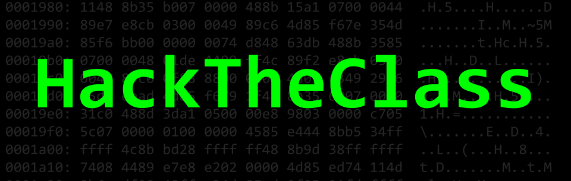

# CMSC389R: Introduction to Ethical Hacking (HackTheClass)

## Course Description
This practical, hands-on [1-credit course](http://sticsumd.com/) provides students with an introduction to ethical hacking. The course begins with a discussion on the ethics behind security research and progresses to topics that surround penetration testing, forensics, cryptology, and binary reverse engineering and exploitation. This course is also meant to introduce students to Capture-the-Flag (CTF) style cybersecurity challenges, encourages participation in UMD's Cybersecurity Club ([UMDCSEC](https://csec.umd.edu)), and prepares for CMSC414.

## Course Details
- **Course**: [CMSC389R](https://app.testudo.umd.edu/soc/search?courseId=cmsc389r&sectionId=&termId=201901&_openSectionsOnly=on&creditCompare=&credits=&courseLevelFilter=ALL&instructor=&_facetoface=on&_blended=on&_online=on&courseStartCompare=&courseStartHour=&courseStartMin=&courseStartAM=&courseEndHour=&courseEndMin=&courseEndAM=&teachingCenter=ALL&_classDay1=on&_classDay2=on&_classDay3=on&_classDay4=on&_classDay5=on)
- **Prerequisites**: C- or better in CMSC216 and CMSC250
- **Credits**: 1
- **Seats**: 60, (30/section)
- **Lecture Time**: Fridays, 1-1:50 PM (0101) and 2-2:50 PM (0201)
- **Location**: CSI 2118
- **Semester**: Spring 2019
- **Textbook**: None
- **Course Facilitators**: [Michael Reininger](https://www.github.com/1umpus), [Wesley Weidenhamer](https://github.com/wesley27), [Joshua Fleming](https://github.com/jsfleming), and [Mike Bailey](https://github.com/Miskerest)
- **Faculty Advisor**: [Dave Levin](http://www.cs.umd.edu/~dml/)
- **Syllabus Last Updated**: January 28, 2019
- **Previous Offering**: [Spring 2018](https://github.com/UMD-CS-STICs/389Rspring18), [Fall 2018](https://github.com/UMD-CS-STICs/389Rfall18)

## Topics Covered
- Security research ethics
    - Cyberlaw
    - Responsible disclosure
    - Expectation of privacy
- Linux
    - Command line
    - Configuring an environment
    - Virtual machines
- Target reconnaissance
    - OSINT
    - Social engineering
    - OPSEC
- Penetration testing
    - Vulnerability scanning
    - Using automated tools
    - Maintaining persistence
- Forensics
    - Imaging
    - File types and carving
    - Metadata
    - File system artifacts
    - Network packet captures
    - Steganography
- Binaries
    - Reverse engineering
    - Stack-based buffer overflow
- Web
    - Javascript deobfuscation
    - SQL injection
    - XSS
- Cryptography
    - Classic ciphers
    - Symmetric and asymmetric key
    - Hash-length extension attacks
    - Password cracking
- Capture the Flag (CTF)
    - Jeopardy vs Attack-Defense
    - Write-ups and Proof-of-Concept (PoC)

## Grading
Assignments should be submitted through your personal fork of our class repository. Instructions on how to set this up and do it can be found [here](guides/git_instructions.md).

Grades will be released through [ELMS](https://myelms.umd.edu/courses/1261976).

You are responsible for all material discussed in lecture and posted on the class repository, including announcements, deadlines, policies, etc.

Your final course grade will be determined according to the following percentages:

| Percentage | Title | Description |
| ------------- | -----|-------- |
| 55% | Write-ups  | Weekly individual write-ups (250-500 words) that summarize and explain your solutions to the assigned CTF challenges or concepts covered in lecture. |
| 20% | Midterm | Examination on topics covered until Forensics II. |
| 25% | Final Hack | Demonstrate mastery of all topics learned and apply knowledge to change your grade on the class's private grade server. The grade earned will be determined by levels unlocked in the grade server and will be applied to your official final grade.

Any request for reconsideration of any grading on coursework must be submitted within 36 hours  of when it is returned. No requests will be considered afterwards.

Assignments may be submitted up to 3 days late for a 10%/day penalty.

## Schedule

| Week | Topic | Assignment |
| ----|----|----- |
| 1 (2/1) | [Introduction + Ethics](lectures/1_Intro+Ethics.pdf) | [Writeup 1](assignments/1_Ethics/), Download [VirtualBox](https://www.virtualbox.org/), [Kali](https://www.kali.org/), [Gray Hat Hacking (Ch. 1)](https://archive.org/details/GrayHatHackingTheEthicalHackersHandbook3rdEdition), [OSINT Handbook](https://www.i-intelligence.eu/wp-content/uploads/2016/11/2016_November_Open-Source-Intelligence-Tools-and-Resources-Handbook.pdf)
| 2 (2/8) |[OSINT](lectures/) | [Writeup 2](assignments/2_OSINT/), [Kali VM installation instructions](guides/kali_instructions.pdf)|
| 3 (2/15) | [OPSEC, Vulnerability scanning, Social Engineering](lectures/) | [Writeup 3](assignments/3_OPSEC_SE) |
| 4 (2/22) | [Penetration Testing](lectures/) | [Writeup 4](assignments/4_Pentesting_I) |
| 5 (3/1) | [Forensics I](lectures/) | [Writeup 5](assignments/) |
| 6 (3/8) | [Forensics II](lectures/6_Forensics_II) | [Writeup 6](assignments/) |
| 7 (3/15) | Midterm | |
| 9 (3/22) | Spring Break | |
| 10 (3/29) | [Forensics II](https://github.com/UMD-CS-STICs/389Rspring19/blob/master/lectures/6_Forensics_II.pdf) | [Writeup 6](assignments/6_Forensics_II) |
| 10 (4/5) | [Binaries I](lectures/) | [Writeup 9](assignments/) |
| 11 (4/12) | [Cryptography I](lectures/) | [Writeup 10](assignments/) |
| 12 (4/19) | [Cryptography II](lectures/) | [Writeup 11](assignments/) |
| 13 (4/26) | [Web I](lectures/) | [Writeup 7](assignments/) |
| 14 (5/3) | [Web II](lectures/) | [Writeup 12](assignments/) |
| 16 (5/10) | [Wrap-up](lectures/) | Final hack. |

The timeline is not final and can be subject to change.

## Communicating with course staff

Official announcements will be sent through the course Piazza. Interaction between students and course staff will also occur via Piazza. Email should only be used for emergencies.

Office hours will be provided after class on Friday's from 3-4 PM. Course staff will remain in the classroom to answer questions and provide assistance as needed. Meetings can also be scheduled via Piazza.

Faculty Admin:

Dr. Dave Levin - dml@cs.umd.edu

Instructors:

Michael Reininger - michael@csec.umiacs.umd.edu

Wesley Weidenhamer - wesley@csec.umiacs.umd.edu

Joshua Fleming - president@csec.umiacs.umd.edu

Mike Bailey - misker@protonmail.com

## Excused Absence and Academic Accommodations
See the section titled <a href="http://www.ugst.umd.edu/courserelatedpolicies.html">Course Related Policies</a>.

## Disability Support Accommodations
See the section titled "Accessibility" available at <a href="http://www.ugst.umd.edu/courserelatedpolicies.html">Course Related Policies</a>.

## Academic Integrity
Note that academic dishonesty includes not only cheating, fabrication, and plagiarism, but also includes helping other students commit acts of academic dishonesty by allowing them to obtain copies of your work. In short, all submitted work must be your own. Cases of academic dishonesty will be pursued to the fullest extent possible as stipulated by the <a href="http://osc.umd.edu/OSC/Default.aspx">Office of Student Conduct</a>.

It is very important for you to be aware of the consequences of cheating, fabrication, facilitation, and plagiarism. For more information on the Code of Academic Integrity or the Student Honor Council, please visit http://www.shc.umd.edu.

# Course Evaluations
If you have a suggestion for improving this class, don't hesitate to tell the instructor or TAs during the semester. At the end of the semester, please don't forget to provide your feedback using the campus-wide CourseEvalUM system. Your comments will help make this class better.
